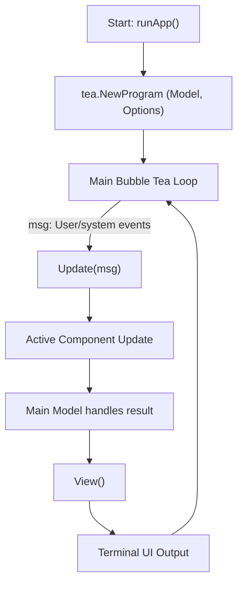

# SSH-X-Term Bubble Tea Architecture Schema

## Core Bubble Tea Loop

SSH-X-Term is structured around Bubble Tea’s Model-Update-View (MUV) architecture, with distinct application states and modular UI components.

### 1. Model

- **File:** `internal/ui/model.go`
- **Definition:** The `Model` struct holds all UI state, including:
  - `state`: Current high-level app state (`AppState` enum, e.g., `StateConnectionList`, `StateSSHTerminal`)
  - Pointers to all UI components (e.g., `connectionList`, `terminal`, `bitwardenLoginForm`, etc.)
  - Dimensions (`width`, `height`)
  - Configuration and credential managers

- **App States (`AppState` enum):**
  - `StateSelectStorage`
  - `StateBitwardenConfig`
  - `StateConnectionList`
  - `StateAddConnection`
  - `StateEditConnection`
  - `StateSSHTerminal`
  - `StateBitwardenLogin`
  - `StateBitwardenUnlock`
  - `StateOrganizationSelect`
  - `StateCollectionSelect`

- **Active Component:**  
  The method `getActiveComponent()` returns the UI component corresponding to the current state (e.g., `connectionList` for `StateConnectionList`).

---

### 2. Update

- **File:** `internal/ui/update.go`
- **Definition:**  
  The `Update(msg tea.Msg) (tea.Model, tea.Cmd)` method is the heart of the event loop.
  - Receives messages (keyboard, window size, etc.).
  - Switches on message type and current state.
  - Delegates to the active component’s `Update` method.
  - Handles global logic (e.g., state transitions, error handling, component resets).

- **Stateful Logic Examples:**
  - In `StateConnectionList`, handles keybindings:  
    - 'a': Add connection (`StateAddConnection`)
    - 'e': Edit highlighted connection (`StateEditConnection`)
    - 'd': Delete highlighted connection
    - 'o': Toggle open in new terminal
    - 'esc': Back to previous state
    - 'ctrl+c': Quit
  - For window resizing, updates model dimensions and resizes the active component.

- **Component Results:**  
  After delegating to a component’s `Update`, the main model processes any results (e.g., a submitted form advances to the next state).

---

### 3. View

- **File:** `internal/ui/view.go`
- **Definition:**  
  The `View() string` method renders the UI:
  - Prepends the app title.
  - Renders the active component’s view (from `getActiveComponent().View()`).
  - Appends contextual instructions depending on the state.
  - Displays error messages if present.

---

### 4. UI Components

Each major function of the app is encapsulated in a component (e.g., `ConnectionList`, `ConnectionForm`, `TerminalComponent`, `BitwardenLoginForm`, etc.), each implementing Bubble Tea’s `Model`, `Update`, and `View` methods.

- **Location:** `internal/ui/components/`
- **Component Examples:**
  - `ConnectionList`
  - `ConnectionForm`
  - `TerminalComponent`
  - `BitwardenLoginForm`
  - `BitwardenUnlockForm`
  - `BitwardenOrganizationList`
  - `BitwardenCollectionList`
  - `StorageSelect`

---

### 5. State Transitions

- Transitions are managed via the main model’s `state` field.
- Example flow:
  1. **Startup**:  
     - State: `StateSelectStorage`
     - User chooses storage backend (local/Bitwarden).
  2. **After Storage Selection**:  
     - State: `StateConnectionList` (local) or `StateBitwardenConfig/StateBitwardenLogin/StateBitwardenUnlock` (Bitwarden).
  3. **Connection Actions**:  
     - Add/Edit/Delete/Connect transitions handled via forms and connection list.
  4. **SSH Session**:  
     - State: `StateSSHTerminal`, which manages the live SSH session UI.

---

## Bubble Tea Loop Schema Diagram



---

## Summary Table: State → Component Mapping

| AppState                  | Active Component              | Description / UI |
|---------------------------|-------------------------------|------------------|
| StateSelectStorage        | StorageSelect                 | Storage backend selector |
| StateBitwardenConfig      | BitwardenConfigForm           | Bitwarden server/email config |
| StateBitwardenLogin       | BitwardenLoginForm            | Bitwarden login prompt |
| StateBitwardenUnlock      | BitwardenUnlockForm           | Bitwarden unlock prompt |
| StateOrganizationSelect   | BitwardenOrganizationList     | Org selector (Bitwarden) |
| StateCollectionSelect     | BitwardenCollectionList       | Collection selector (Bitwarden) |
| StateConnectionList       | ConnectionList                | SSH connections list |
| StateAddConnection        | ConnectionForm                | Add new SSH connection |
| StateEditConnection       | ConnectionForm                | Edit existing SSH connection |
| StateSSHTerminal          | TerminalComponent             | Interactive SSH terminal with VT100 emulation |

---

## Terminal Emulation Architecture

The SSH terminal is fully integrated within Bubble Tea using a custom virtual terminal emulator:

### Components

1. **VTerminal** (`internal/ui/components/vterm.go`)
   - Virtual terminal emulator with VT100/ANSI escape sequence parsing
   - Maintains display buffer and scrollback buffer (10,000 lines)
   - Handles cursor positioning, colors, and terminal control sequences
   - Supports text selection and clipboard operations

2. **BubbleTeaSession** (`internal/ssh/session_bubbletea_unix.go`, `session_bubbletea_windows.go`)
   - SSH session wrapper that works with Bubble Tea
   - Provides Read/Write interfaces for bidirectional communication
   - Handles window resize events
   - Platform-specific implementations for Unix and Windows

3. **TerminalComponent** (`internal/ui/components/terminal.go`)
   - Bubble Tea component that integrates VTerminal and BubbleTeaSession
   - Handles user input (keyboard and mouse)
   - Forwards keystrokes to SSH session
   - Renders terminal output within Bubble Tea UI
   - Manages scrolling and text selection

### Data Flow

```
User Input (Keyboard/Mouse)
    ↓
TerminalComponent.Update()
    ↓
BubbleTeaSession.Write() ──→ SSH Server
    ↓
SSH Server Output
    ↓
SSHOutputMsg
    ↓
VTerminal.Write() (ANSI parsing)
    ↓
VTerminal.Render()
    ↓
Display in Bubble Tea View
```

### Key Features

- **No Terminal Takeover**: Works entirely within Bubble Tea (no raw mode on host terminal)
- **Full Terminal Emulation**: Supports VT100/ANSI escape sequences
- **Scrollback**: 10,000 line buffer with keyboard and mouse scrolling
- **Text Selection**: Click and drag to select, automatic clipboard copy
- **Resize Support**: Handles terminal resize events seamlessly
- **Keyboard Support**: Full support for special keys (arrows, home, end, function keys, etc.)

---

## References

- [Bubble Tea Architecture](https://github.com/charmbracelet/bubbletea)
- [README](https://github.com/eugeniofciuvasile/ssh-x-term/blob/main/README.md)
- Key Files:  
  - `internal/ui/model.go`  
  - `internal/ui/update.go`  
  - `internal/ui/view.go`  
  - `internal/ui/components/`
  - `internal/ui/components/vterm.go` - Virtual terminal emulator
  - `internal/ui/components/terminal.go` - Terminal component
  - `internal/ssh/session_bubbletea_unix.go` - Unix SSH session
  - `internal/ssh/session_bubbletea_windows.go` - Windows SSH session
