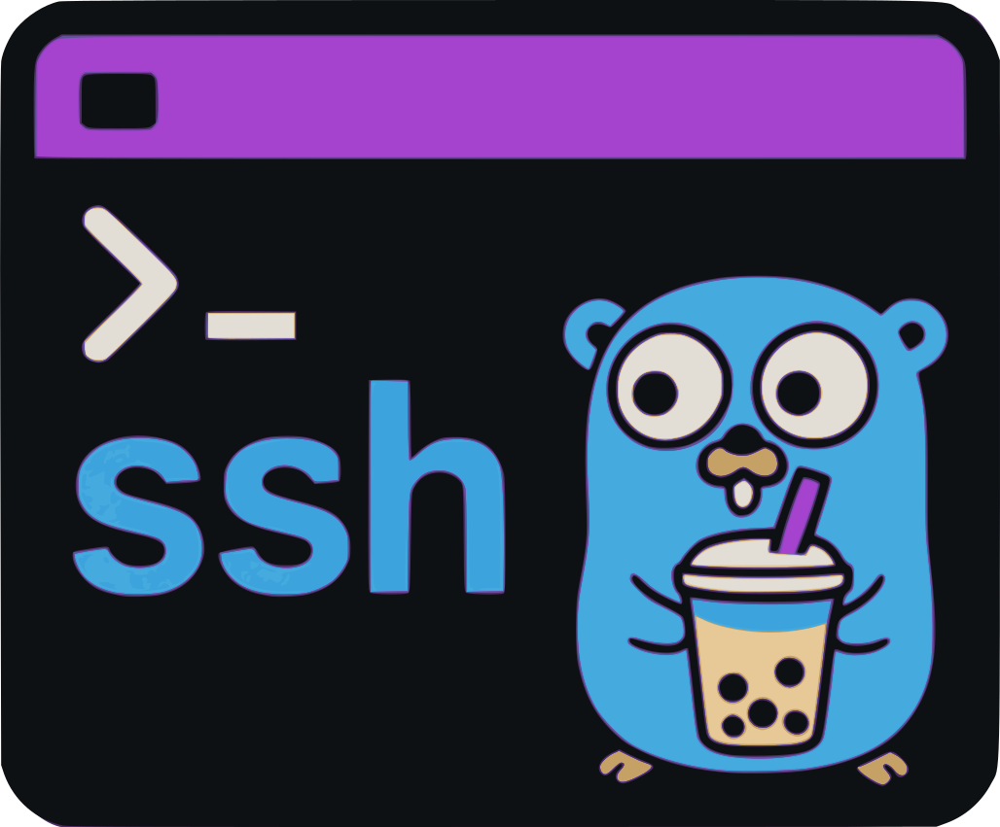
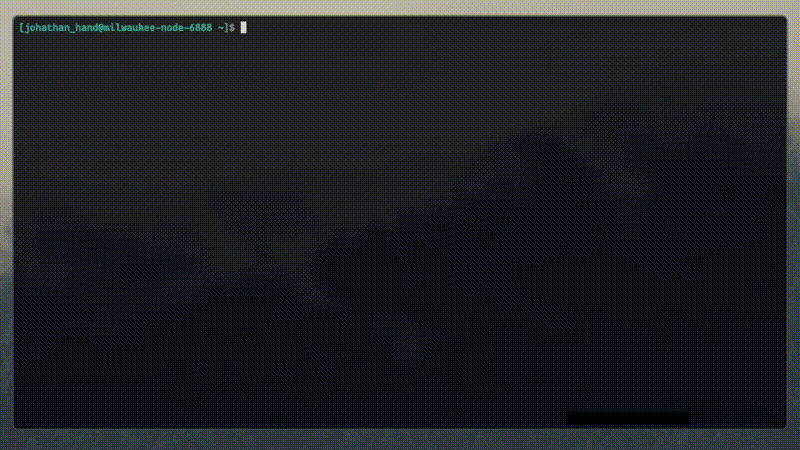

# SSH-X-Term

<p align="center">
  <picture>
    <source media="(prefers-color-scheme: dark)" srcset="./logo.svg" width="240">
    <source media="(prefers-color-scheme: light)" srcset="./logo.svg" width="240">
    
  </picture>
  <br>
  <a href="https://github.com/eugeniofciuvasile/ssh-x-term/releases"></a>
  <a href="https://www.npmjs.com/package/ssh-x-term"></a>
  <a href="https://github.com/eugeniofciuvasile/ssh-x-term/releases"></a>
  <a href="https://www.npmjs.com/package/ssh-x-term"></a>
  <a href="https://github.com/eugeniofciuvasile/ssh-x-term/actions"></a>
  <a href="https://github.com/eugeniofciuvasile/ssh-x-term/stargazers"></a>
  <a href="https://github.com/eugeniofciuvasile/ssh-x-term/blob/main/LICENSE"></a>
</p>

**SSH-X-Term** is a powerful terminal-based SSH client with a TUI (Text User Interface) built on [Bubble Tea](https://github.com/charmbracelet/bubbletea).  
It seamlessly integrates **SSH connection management**, **SCP/SFTP file transfers**, and **secure credential storage** into a single, responsive interface.

Credentials can be stored securely using your **local system keyring** (via [go-keyring](https://github.com/zalando/go-keyring)) or directly in your **Bitwarden vault**.  
Cross-platform features include support for `passh` (Unix), `plink.exe` (Windows), and full `tmux` integration.

---

### 📺 Demo & Walkthrough

<div align="center">
  
  [](https://www.youtube.com/watch?v=C-s-Lh_VdpQ)
  
  

</div>

---

## 🚀 Features

### 🖥️ Integrated SSH Terminal
Fully functional terminal emulator built entirely within the TUI.
- **Standards Compliant**: VT100/ANSI escape sequence support for proper rendering.
- **Power User Friendly**: 10,000 line scrollback buffer, mouse & keyboard scrolling.
- **Clipboard**: Text selection with mouse (click & drag), automatic copy, or `Ctrl+C`.
- **Responsive**: Full keyboard support and window resize handling.

### 📂 SCP/SFTP File Manager
Seamlessly transfer files without leaving the app.
- **Dual-pane Interface**: Intuitive Local vs. Remote panel navigation.
- **Full Control**: Upload, Download, Rename, Delete, and Create files/directories.
- **Search**: Recursive file search (`/` key) to find deep files instantly.
- **Secure**: Piggybacks on your existing authenticated SSH session.

### 🔐 Secure Credential Management
- **Local Storage**: Encrypted via system keyring (Keychain, Gnome Keyring, Credential Manager).
- **Bitwarden Integration**: Direct access to your vault via Bitwarden CLI.
- **Zero Plaintext**: Passwords are **never** stored in plaintext on disk.

### ⚡ Automation & Compatibility
- **Auto-Login**: Automates password entry using `passh` (Unix) or `plink.exe` (Windows).
- **Key Auth**: Full support for private key authentication.
- **TMUX**: Open connections in new tmux windows automatically.

---

## 📦 Project Structure

```
ssh-x-term/
├── cmd/
│   └── sxt/
│       └── main.go                                # Application entry point
├── internal/
│   ├── config/
│   │   ├── bitwarden.go                          # Bitwarden vault integration and management
│   │   ├── config.go                             # Local configuration handling with go-keyring
│   │   ├── models.go                             # Configuration data models
│   │   ├── pathutil.go                           # Path utilities (home directory expansion)
│   │   └── storage.go                            # Storage interface definition
│   ├── ssh/
│   │   ├── client.go                             # SSH client implementation
│   │   ├── session_bubbletea_unix.go             # SSH session management (Unix)
│   │   ├── session_bubbletea_windows.go          # SSH session management (Windows)
│   └── ui/
│       ├── components/
│       │   ├── bitwarden_collection_list.go      # Bitwarden collection selector
│       │   ├── bitwarden_config.go               # Bitwarden CLI configuration form
│       │   ├── bitwarden_login_form.go           # Bitwarden login form component
│       │   ├── bitwarden_organization_list.go    # Bitwarden organization selector
│       │   ├── bitwarden_unlock_form.go          # Bitwarden unlock form component
│       │   ├── connection_list.go                # List of SSH connections
│       │   ├── form.go                           # Form for adding/editing connections
│       │   ├── scp_manager.go                    # SCP/SFTP File Manager component
│       │   ├── storage_select.go                 # Credential storage selection (Local/Bitwarden)
│       │   ├── terminal.go                       # Terminal component for SSH sessions
│       │   ├── vterm.go                          # Virtual terminal component integrated inside Bubble Tea
│       │   └── vterm_test.go                     # Virtual terminal tests
│       ├── connection_handler.go                 # Connection lifecycle management
│       ├── model.go                              # Main UI model and state
│       ├── update.go                             # Update logic for UI events
│       └── view.go                               # View rendering logic
├── pkg/
│   └── sshutil/
│       └── auth.go                               # Authentication utilities
├── go.mod                                        # Go module dependencies
├── go.sum                                        # Go module checksums
├── package.json                                  # npm package configuration
├── index.js                                      # npm entry point
├── install.js                                    # npm post-install script
├── LICENSE                                       # MIT License
├── CONTRIBUTING.md                               # Contribution guidelines
├── FLOW.md                                       # Application flow documentation
└── README.md                                     # This file
```

**Note:**  
- **Local Storage Mode**: Uses `go-keyring` to securely store passwords in the system keyring (see `config.go`)
- **Bitwarden Integration**: Managed through several components:
  - `bitwarden.go` handles vault operations via Bitwarden CLI
  - `bitwarden_config.go`, `bitwarden_login_form.go`, `bitwarden_unlock_form.go` for authentication flows
  - `bitwarden_organization_list.go`, `bitwarden_collection_list.go` for organizational vault management
  - `storage_select.go` lets users choose between Local (with go-keyring) or Bitwarden storage
 
**Flow chart**
- [FLOW](https://github.com/eugeniofciuvasile/ssh-x-term/blob/main/FLOW.md)

---

## 🛠️ Prerequisites

- **Go 1.24+**
- **System Keyring** (for local storage):
  - 🍎 **macOS**: Keychain (built-in)
  - 🐧 **Linux**: Secret Service API (`gnome-keyring`, `kwallet`, etc.)
  - 🪟 **Windows**: Credential Manager (built-in)
- **External Tools**:
  - **Bitwarden CLI (`bw`)** — optional, for Bitwarden vault credential management ([install guide](https://bitwarden.com/help/cli/))
  - **passh** — for password authentication on Unix ([compile it from here](https://github.com/clarkwang/passh))
  - **tmux** — recommended for multi-window SSH sessions ([install guide](https://github.com/tmux/tmux/wiki/Installing))
  - **plink.exe** — for password authentication on Windows ([download from PuTTY](https://www.chiark.greenend.org.uk/~sgtatham/putty/latest.html))
  - **(Optional) ssh client** — `ssh` should be available on your system

**Ensure all required binaries are available in your `$PATH`.**

## 📚 System dependencies

ssh-x-term requires the following system tools to be installed:

- `tmux`
- `passh`
- System keyring support (for secure local password storage)
- `bitwarden-cli` (optional, npm package: `@bitwarden/cli`, install globally: `npm install -g @bitwarden/cli`)

### Linux (Debian/Ubuntu):

```sh
sudo apt update
sudo apt install -y tmux gnome-keyring
npm install -g @bitwarden/cli
# follow github repo https://github.com/clarkwang/passh to compile passh
```

### macOS (with Homebrew):

```sh
brew install tmux
npm install -g @bitwarden/cli
# follow github repo https://github.com/clarkwang/passh to compile passh
```

### Windows:

- Install `tmux` and `passh` via WSL/Cygwin or use alternatives.
- Install Bitwarden CLI with: `npm install -g @bitwarden/cli`
- Windows Credential Manager is used by go-keyring and is built-in.

---

## 📥 Installation

### Option 1: Install using npm (Recommended)

The easiest way to install is via the [npm package](https://www.npmjs.com/package/ssh-x-term):

```sh
# Install globally
npm install -g ssh-x-term

# Run
sxt
```

> This automatically attempts to install required dependencies (`bw`, `passh`, `tmux`) if missing.

### Option 2: Build from source

1. **Clone & Build**:
   ```sh
   git clone https://github.com/eugeniofciuvasile/ssh-x-term.git
   cd ssh-x-term
   go build -o sxt ./cmd/sxt
   ```

2. **Install with Go**:
   ```sh
   go install github.com/eugeniofciuvasile/ssh-x-term/cmd/sxt@latest
   ```

### Option 3: Pre-built Binary

Download the latest binary from the [Releases Page](https://github.com/eugeniofciuvasile/ssh-x-term/releases).

---

## 🎮 Usage

1. **Start the App**:
   ```sh
   sxt
   ```

2. **First Run Setup**:
   - Choose **Local Storage** (System Keyring) or **Bitwarden** (Vault).

3. **Manage Connections**:
   - `a` : **Add** a new connection.
   - `e` : **Edit** selected connection.
   - `d` : **Delete** connection.
   - `s` : Open **SCP/SFTP File Manager**.
   - `o` : Toggle **TMUX** mode (open in new window).
   - `Enter` : **Connect** (start SSH session).

4. **📂 Inside SCP Manager**:
   - `Tab` : Switch between **Local** ↔️ **Remote** panels.
   - `Enter` : **Enter** folder.
   - `Backspace` : **Exit** folder.
   - `c` : **Change** folder.
   - `g` : **Get**/**Download** file/folder.
   - `u` : **Upload** file/folder.
   - `n` : Create **New** file/folder.
   - `r` : **Rename** file.
   - `d` : **Delete** file.
   - `/` : **Search** recursively.

5. **🖥️ Inside SSH Session**:
   - `PgUp` / `PgDn` : Scroll history.
   - `Ctrl+D` : Send EOF.
   - `Esc` `Esc` (Double Press) : Disconnect and return to menu.

---

## ⚙️ Configuration

| Storage Mode | Details |
|--------------|---------|
| **Local** | • Config at `~/.ssh/config` (standard SSH config file)<br>• Passwords stored in **System Keyring**.<br>• Metadata stored as comments in SSH config.<br>• Fully compatible with standard SSH tools. |
| **Bitwarden** | • Secrets stored in your **Bitwarden Vault**.<br>• Requires `bw` CLI.<br>• Supports Organizations & Collections. |

**Note:** If you're upgrading from a previous version that used JSON config (`~/.config/ssh-x-term/ssh-x-term.json`), your connections will be automatically migrated to the SSH config format on first run.

---

## 🛡️ Security & Disclaimer

**SSH-X-Term** is an independent open-source project released under the [MIT License](LICENSE).

- **Credentials**: Your passwords/keys are handled securely via system APIs or Bitwarden. They are **never** logged or stored in plaintext files.
- **Responsibility**: The safe handling of your credentials is ultimately your responsibility. The authors bear no liability for data loss or compromise.
- **Affiliation**: Not affiliated with Bubble Tea, Bitwarden, or PuTTY.

---

## 👏 Credits

- [Bubble Tea](https://github.com/charmbracelet/bubbletea) — The TUI framework.
- [go-keyring](https://github.com/zalando/go-keyring) — Secure keyring integration.
- [Bitwarden CLI](https://bitwarden.com/help/cli/) — Vault management.
- [passh](https://github.com/clarkwang/passh) & [PuTTY](https://www.chiark.greenend.org.uk/~sgtatham/putty/latest.html) — Auth automation.
