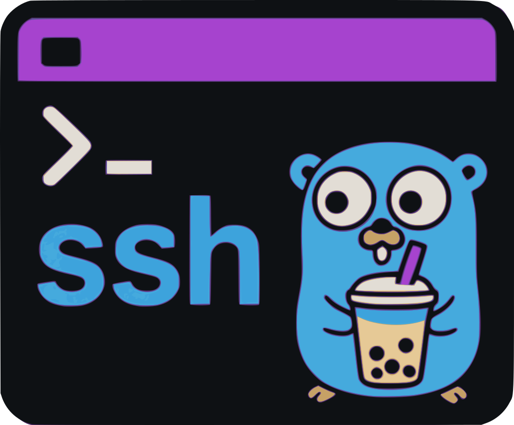
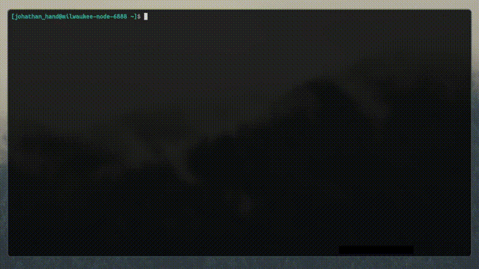

# SSH-X-Term

<p align="center">
  <picture>
    <source media="(prefers-color-scheme: dark)" srcset="./logo.svg" width="240">
    <source media="(prefers-color-scheme: light)" srcset="./logo.svg" width="240">
    
  </picture>
  <br>
  <!-- Releases -->
  <a href="https://github.com/eugeniofciuvasile/ssh-x-term/releases"></a>
  <!-- Homebrew -->
  <a href="https://github.com/eugeniofciuvasile/homebrew-tap"></a>
  <!-- Chocolatey -->
  <a href="https://community.chocolatey.org/packages/ssh-x-term"></a>
  <!-- NPM -->
  <a href="https://www.npmjs.com/package/ssh-x-term"></a>
  <!-- Downloads -->
  <a href="https://github.com/eugeniofciuvasile/ssh-x-term/releases"></a>
  <a href="https://www.npmjs.com/package/ssh-x-term"></a>
  <!-- CI -->
  <a href="https://github.com/eugeniofciuvasile/ssh-x-term/actions"></a>
  <!-- Meta -->
  <a href="https://github.com/eugeniofciuvasile/ssh-x-term/stargazers"></a>
  <a href="https://github.com/eugeniofciuvasile/ssh-x-term/blob/main/LICENSE"></a>
</p>

---

**SSH-X-Term** is a modern, terminal-based SSH client with a rich TUI (Text User Interface) built on
[Bubble Tea](https://github.com/charmbracelet/bubbletea).

SSH-X-Term is a **fully self-contained SSH client** implemented entirely in Go.
There are **no external SSH tools or wrappers** involved — all SSH, SCP, SFTP, port tunneling, packet inspection, and terminal handling is built in.

It combines **SSH connection management**, **interactive terminals**, **SCP/SFTP file transfers**, **visual port forwarding & traffic inspection**, and **secure credential storage** into a single, fast, cross-platform application.

Credentials can be stored securely using your **local system keyring** or directly in your **Bitwarden vault**.

---

## ✨ Highlights

* ✅ **Pure Go SSH client** — no `ssh`, no `passh`, no `plink` required
* ✅ **SSH Port Forwarding & Tunnels** — Local (`-L`), Remote (`-R`), and Dynamic SOCKS5 (`-D`)
* ✅ **Visual Topology Diagrams** — interactive ASCII/Unicode tunnel graph with live metrics
* ✅ **Live Packet Inspector & Hex Dump** — stream raw payload packets in real time with 1-click clipboard export
* ✅ **Cross-platform** — identical behavior and rendering on Linux, macOS, and Windows
* ✅ **Built-in terminal emulator** — full xterm-256color support with scrollback buffer
* ✅ **SCP / SFTP Dual-Pane File Manager** — seamlessly transfer files over existing sessions
* ✅ **Secure Credential Storage** — system keyring (Keychain, Secret Service, Credential Manager) + Bitwarden CLI
* ✅ **First-class TUI** — responsive, keyboard-driven, mouse-aware full-screen experience

---

## 📺 Demo & Walkthrough

<div align="center">

[](https://www.youtube.com/watch?v=C-s-Lh_VdpQ)



</div>

---

## 🚀 Features

### 🔀 SSH Port Forwarding & Tunnel Manager

Manage and monitor SSH tunnels directly within the TUI without remembering complex CLI flags.

* **Supported Tunnel Modes**:
  * **Local Port Forwarding (`-L`)**: Forward local ports to remote services (e.g. remote VNC desktop `5900` ➔ `127.0.0.1:5900`, private PostgreSQL/MySQL databases, internal web dashboards, Kubernetes pods).
  * **Remote Port Forwarding (`-R`)**: Expose local development servers or APIs to a remote relay server.
  * **Dynamic SOCKS5 Proxy (`-D`)**: Turn your remote SSH host into a flexible SOCKS5 proxy for browsers and CLI tools.
* **Port Conflict Detection**: Automatically verifies local and remote port availability before binding to prevent socket collisions.
* **Auto-Start Support**: Flag tunnels to automatically activate whenever a host connection is initiated.
* **Safe Persistent Storage**: Saved directly alongside your host configuration with OpenSSH compatibility.

```
                       ◄  Tunnel 1 of 1: Remote VNC Desktop  ►

  ╭───────────────────── TOPOLOGY: LOCAL (Remote VNC Desktop) ───────────────────────╮
  │                                                                                  │
  │  ╭──────────────────╮              ╭──────────────────╮              ╭──────────────────╮  │
  │  │  LOCAL LISTENER  │  ══(SSH)══►  │    SSH RELAY     │  ──(TCP)──►  │  REMOTE TARGET   │  │
  │  │  127.0.0.1:5900  │              │  remote-host:22  │              │  127.0.0.1:5900  │  │
  │  │  (Your Machine)  │              │(Bastion / Server)│              │ (Target Service) │  │
  │  ╰──────────────────╯              ╰──────────────────╯              ╰──────────────────╯  │
  │                                                                                  │
  ╰──────────────────────────────────────────────────────────────────────────────────╯
 ╭──────────────────┬──────────────────┬────────────────────────────────────┬──────────────────╮
 │ STATUS: ● ACTIVE │ CONNS: 1 active  │ TRAFFIC: ▲ 14.2 KB    ▼ 84.1 KB    │ UPTIME: 08m 42s  │
 ╰──────────────────┴──────────────────┴────────────────────────────────────┴──────────────────╯
```

---

### 🔍 Visual Topology & Live Packet Inspector

Inspect the live data stream flowing through your SSH tunnels in real time.

* **Visual 2D Topology Diagram (<kbd>v</kbd> / <kbd>g</kbd>)**:
  * Clear box-and-arrow diagrams detailing listener, bastion gateway, and target endpoints.
  * Color-coded statuses: Neon Green (`● ACTIVE`), Gray (`○ INACTIVE`), Red (`✖ ERROR`).
  * Live metrics dashboard: active connection counts, directional byte counters, and uptime.
* **Live Traffic Inspector (<kbd>x</kbd>)**:
  * Bidirectional stream tagging (`LOCAL -> REMOTE` vs `REMOTE -> LOCAL`) with microsecond timestamps.
  * **Hex + ASCII Dump Mode**: Wireshark-style 16-byte hexadecimal offsets alongside ASCII text columns.
  * **ASCII Text Stream Mode (<kbd>m</kbd>)**: Clean formatted text view for HTTP, Redis, SMTP, or plain socket streams.
  * **Stream Controls**: Pause / Freeze live feed (<kbd>f</kbd> / <kbd>Space</kbd>), scroll history (<kbd>↑</kbd>/<kbd>↓</kbd>/<kbd>PgUp</kbd>/<kbd>PgDn</kbd>), and clear buffer (<kbd>c</kbd>).
* **1-Click Clipboard Export (<kbd>y</kbd>)**:
  * Instantly copy all raw captured traffic data (Hex Dump or ASCII) to the system clipboard.

```
  LIVE TRAFFIC INSPECTOR: Web Service Tunnel (HEX + ASCII DUMP)    [✓ COPIED TO CLIPBOARD] 
 ╭──────────────────────────────────────────────────────────────────────────────────╮
 │  ──► [12:00:00.100] LOCAL -> REMOTE (16 bytes)                                   │
 │    00000000  47 45 54 20 2f 20 48 54  54 50 2f 31 2e 31 0d 0a  |GET / HTTP/1.1..| │
 │                                                                                  │
 │  ◄── [12:00:00.115] REMOTE -> LOCAL (17 bytes)                                   │
 │    00000000  48 54 54 50 2f 31 2e 31  20 32 30 30 20 4f 4b 0d  |HTTP/1.1 200 OK.| │
 │    00000010  0a                                                |.|                │
 ╰──────────────────────────────────────────────────────────────────────────────────╯
```

---

### ⚡ Quick Connect Mode

Fast SSH access without launching the full TUI.

* `sxt -l` — minimal interactive connection selector
* `sxt -c <connection-id>` — instant connection by ID
* Start typing immediately to filter connections
* Arrow keys exit filter and navigate
* Fully interactive terminal with resize support

---

### 🖥️ Integrated SSH Terminal

* VT100 / ANSI escape sequence compliant
* Full **xterm-256color** support
* 10,000-line scrollback buffer
* Mouse and keyboard scrolling
* Text selection and clipboard copy
* Graceful window resize handling

---

### 📂 SCP / SFTP File Manager

* Dual-pane Local ↔ Remote interface
* Upload, download, rename, delete
* Create files and directories
* Recursive search (`/`)
* Uses the active authenticated SSH session

---

### 🔐 Secure Credential Management

* **Local storage** via system keyring
  * macOS Keychain
  * Linux Secret Service (libsecret / GNOME Keyring / KWallet)
  * Windows Credential Manager
* **Bitwarden integration** via Bitwarden CLI (`bw`)
* Passwords and private key passphrases are never stored in plaintext

---

### ⚙️ SSH Authentication

* SSH Agent (recommended for encrypted keys)
* Encrypted private keys supported via `ssh-agent`
* Password authentication via system keyring
* Compatible with standard OpenSSH config

---

## 🛠️ Prerequisites

### Required
* **Go 1.24+** (only if building from source)
* **System Keyring** (for local password storage)

### Optional
* **SSH Agent** (recommended for encrypted SSH keys)
* **Bitwarden CLI (`bw`)** — for Bitwarden vault support
* **tmux** — open SSH sessions in new tmux windows

> ⚠️ SSH-X-Term 2.0+ has **no external SSH dependencies**.
> You do not need `ssh`, `passh`, `plink`, or PuTTY.

---

## 📥 Installation

### Option 1: Install via npm (Recommended)

```sh
npm install -g ssh-x-term
sxt
```

### Option 2: Install via Homebrew (macOS/Linux)

```sh
brew tap eugeniofciuvasile/tap
brew install ssh-x-term
sxt
```

### Option 3: Build from source

```sh
git clone https://github.com/eugeniofciuvasile/ssh-x-term.git
cd ssh-x-term
go build -o sxt ./cmd/sxt
```

Or:

```sh
go install github.com/eugeniofciuvasile/ssh-x-term/cmd/sxt@latest
```

### Option 4: Prebuilt Binary

Download prebuilt binaries for Linux, macOS, and Windows from the [GitHub Releases](https://github.com/eugeniofciuvasile/ssh-x-term/releases) page.

---

## 🎮 Keybindings & Controls

### Main Host View
| Key | Action |
| --- | --- |
| <kbd>Enter</kbd> | Connect to selected SSH host |
| <kbd>t</kbd> | Open **Tunnel & Port Forwarding Manager** |
| <kbd>s</kbd> | Open **SCP / SFTP File Manager** |
| <kbd>a</kbd> / <kbd>e</kbd> / <kbd>d</kbd> | Add / Edit / Delete host connection |
| <kbd>o</kbd> | Toggle tmux session window mode |
| <kbd>/</kbd> | Filter / Search hosts |
| <kbd>q</kbd> | Quit application |

### Tunnel Manager (<kbd>t</kbd>)
| Key | Action |
| --- | --- |
| <kbd>Space</kbd> / <kbd>Enter</kbd> | **Activate / Deactivate** selected tunnel |
| <kbd>v</kbd> / <kbd>g</kbd> | Open **Visual Topology Graph & Inspector** |
| <kbd>a</kbd> / <kbd>e</kbd> / <kbd>d</kbd> | Add / Edit / Delete tunnel configuration |
| <kbd>Esc</kbd> / <kbd>q</kbd> | Return to host list |

### Tunnel Form (<kbd>a</kbd> / <kbd>e</kbd>)
| Key | Action |
| --- | --- |
| <kbd>Tab</kbd> / <kbd>Shift+Tab</kbd> | Navigate fields |
| <kbd>Ctrl+T</kbd> | Cycle tunnel type (`Local -L` / `Remote -R` / `Dynamic -D`) |
| <kbd>Ctrl+A</kbd> | Toggle **Auto-start on Connect** |
| <kbd>Enter</kbd> | Save tunnel |
| <kbd>Esc</kbd> | Cancel |

### Topology Graph & Live Inspector (<kbd>v</kbd> / <kbd>g</kbd>)
| Key | Action |
| --- | --- |
| <kbd>Space</kbd> / <kbd>Enter</kbd> | Activate / Deactivate tunnel |
| <kbd>x</kbd> | Toggle **Live Traffic Inspector** / Topology View |
| <kbd>y</kbd> / <kbd>Ctrl+Y</kbd> | **Copy all captured packets to clipboard** |
| <kbd>m</kbd> | Toggle Hex + ASCII Dump / ASCII Text Stream mode |
| <kbd>f</kbd> | Pause / Resume live packet stream |
| <kbd>c</kbd> | Clear packet capture buffer |
| <kbd>←</kbd> / <kbd>→</kbd> | Switch between tunnels |
| <kbd>↑</kbd> / <kbd>↓</kbd> / <kbd>PgUp</kbd> / <kbd>PgDn</kbd> | Scroll packet stream |
| <kbd>Esc</kbd> / <kbd>q</kbd> | Back to Tunnel Manager |

---

## ⚙️ Configuration

| Storage | Description |
| --- | --- |
| Local | Standard SSH config at `~/.ssh/config`, passwords in system keyring |
| Bitwarden | Secrets stored securely in Bitwarden vault via `bw` CLI |

SSH-X-Term stores metadata as clean structured comments in your standard SSH config and remains 100% compatible with OpenSSH tools.

---

## 🔑 SSH Agent Setup (Recommended)

```sh
eval $(ssh-agent)
ssh-add ~/.ssh/id_ed25519
```

Once added, SSH-X-Term can use encrypted keys seamlessly without prompting for passphrases.

---

## 🛡️ Security & Disclaimer

SSH-X-Term is released under the **MIT License**.

* Credentials are never logged or stored in plaintext.
* All secrets are delegated to native OS Keyring APIs or Bitwarden.
* Tunnels run in secure goroutines with memory isolation and bounded ring buffers for packet inspection.

---

## 👏 Credits

* [Bubble Tea](https://github.com/charmbracelet/bubbletea) & [Lip Gloss](https://github.com/charmbracelet/lipgloss) — Terminal UI framework & styling
* [go-keyring](https://github.com/zalando/go-keyring) — Secure OS credential storage
* [Bitwarden CLI](https://bitwarden.com/help/cli/) — Vault integration
* [OpenSSH](https://www.openssh.com/) — Protocol specifications and compatibility
